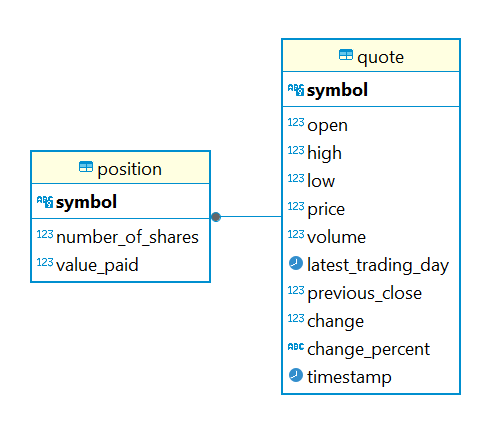

# Introduction
This is a command-line application which allows the user to manage an investment portfolio. The user can buy and sell 
stocks, fetch real-time quote of stocks, and display the content of their portfolio.

Technology used:
- Java
- Maven
- JDBC
- PostgreSQL
- Docker
- Git
- Junit
- Mockito
- TestContainers

# Getting started
A Rapid API is required to run this app. It is needed when fetching stock quote data. Create a Rapid API account and 
subscribe to this [API](https://rapidapi.com/alphavantage/api/alpha-vantage/playground/apiendpoint_6d514147-c965-4ab7-bad1-929b8bf302c0).
Copy and paste your API key into the properties.txt file.

The app also require an SQL database to store the data. Started an instance of PostgreSQL with Docker, a docker compose 
file is provided for this purpose. Simply execute `docker compose docker-compose.yml up -d`. 

# Implementation
## ER Diagram

## Design Patterns
This project makes use of the DAO pattern to manage object transfer between the application and the database.
Simply put, the DAO, or data access object, is an extra layer in the application whose sole purpose is to perform CRUD 
operations in the database. We can write prepared statements in our DAOs and send via an SQL connection.

# Test
We tested our application against the database by using the TestContainers library, which allows us to create Docker 
containers of databases during the execution of our tests. For some methods, such as save(update) and findById, test 
data is needed for the proper validation of those methods. To accomplish this, when initiating our test DB container, 
we use an init script, with the database schema as well as a few sample rows.

# Deployment
The application was dockerized and an image was pushed to Dockerhub.