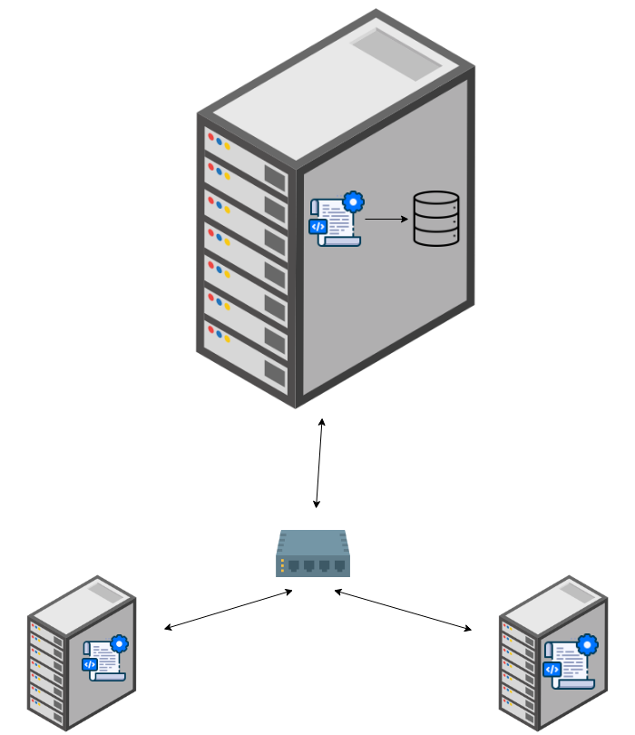

# Linux Cluster Monitoring Agent

---
# Introduction

---
This project is composed of different bash scripts which facilitate the collection of a system's specification and the
system resource usage data in real time. It's intended to be used by the Jarvis Linux Cluster Administration team to 
monitor a cluster of Linux servers.

The technologies used during the completion of this project are:
- Git
- Bash
- Docker
- PostgreSQL

# Quick Start

---
> Pre-requisites:
> Make sure to have Docker and psql installed on the system.  
> 

1. Create and start a psql instance using psql_docker.sh
```bash
psql_docker.sh create postgres password
psql_docker.sh start 
```

2. Create SQL tables using ddl.sql
```bash
psql -h localhost -U postgres -d host_agent -f sql/ddl.sql
```
> Note: a database host_agent must be created manually before running the command.

3. Insert hardware specs data into the DB using host_info.sh
```bash
host_info.sh localhost 5432 host_agent postgres password
```

4. Insert hardware usage data into the DB using host_usage.sh
```bash
host_usage.sh localhost 5432 host_agent postgres password
```

5. Crontab setup
```bash
# edit crontab jobs
crontab -e

# add a new crontab job
* * * * * bash [PATH_TO_host_usage.sh] localhost 5432 host_agent postgres password > /tmp/host_usage.log

# check that the crontab job was added successfully
crontab -l
```

# Implementation

---
## Architecture

---

## Scripts

---
### psql_docker.sh

---
**Description**\
Create, start, and stop a PostgreSQL container.

**Usage**

To Create a PostgreSQL container:
```bash
psql_docker.sh create [USERNAME] [PASSWORD]
```
To start the container:
```bash
psql_docker.sh start
```
To stop the container:
```bash
psql_docker.sh stop
```

### host_info.sh

---
**Description**\
Collect and store hardware specs of the host.

**Usage**

```bash
host_info.sh [hostname] [port] [database] [USERNAME] [PASSWORD]
```

### host_usage.sh

---
**Description**\
Collect and store the current resource usage of the host.

**Usage**

```bash
host_usage.sh [hostname] [port] [database] [USERNAME] [PASSWORD]
```

### ddl.sql

---
**Description**\
Create the tables in the PostgreSQL database.

**Usage**

```bash
psql -h [HOSTNAME] -U [USERNAME] -d [DATABSE] -f ddl.sql
```

## Database Modeling

---
### host_info

| Name       | Type   | Description                |
|------------|--------|----------------------------|
| id         | SERIAL | unique id for the host     |
| hostname   | VARCHAR | name of the host           |
| cpu_number | INT2 | number of CPUs on the host |
| cpu_architecture | VARCHAR | architecture of the host   |
| cpu_model | VARCHAR | model of the CPU           |
| cpu_mhz | FLOAT8 | frequency of the CPU       | 
| l2_cache | INT4 | size of the level 2 cache  |
| timestamp | TIMESTAMP | timestamp for the data     | 
| total_mem | INT4 | total memory on the host   |
---
### host_usage

| Name             | Type      | Description                    |
|------------------|-----------|--------------------------------|
| timestamp        | TIMESTAMP | timestamp for the data         |
| host_id          | SERIAL    | references the id in host_info |
| memory_free       | INT4      | available memory on the host   |
| cpu_idle | INT2      | CPU idle time                  |
| cpu_kernel        | INT2      | CPU usage for the kernel       |
| disk_io          | INT4      | disk IO                        | 
| disk_available         | INT4      | available disk space|
---

# Test

---
The ddl.sql script was executed on a virtual machine. It was verified that the tables were created successfully within the
database.
# Deployment

---
The app was deployed with the help of a crontab job which executes the host_usage.sh script every minute.
# Improvements

---
- Add descriptions and provide usage examples within the bash scripts.
- Automate the creation of the host_agent database.
- Test with multiple hosts