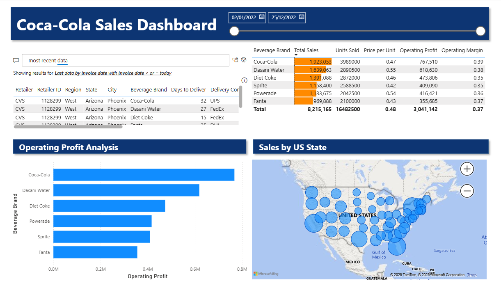
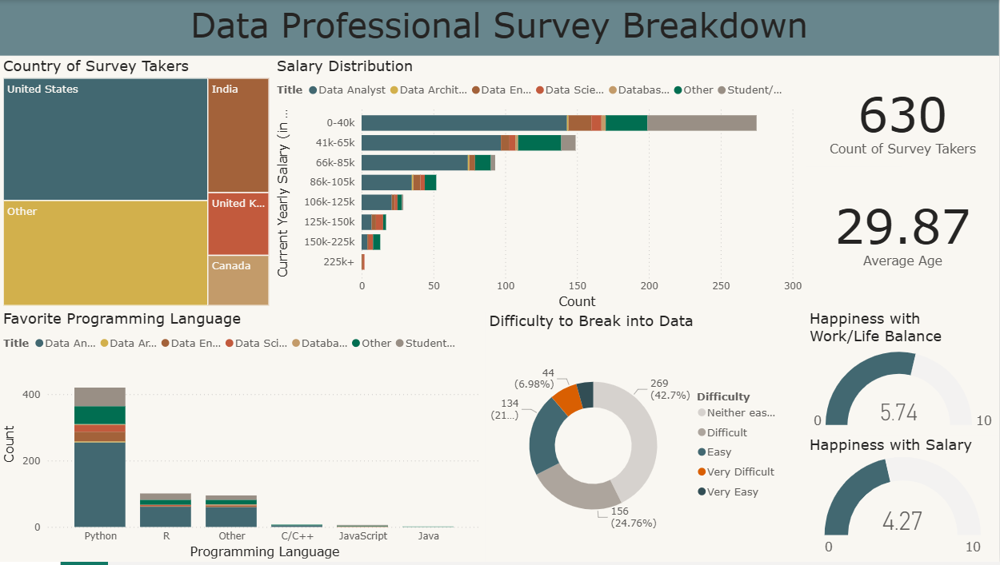
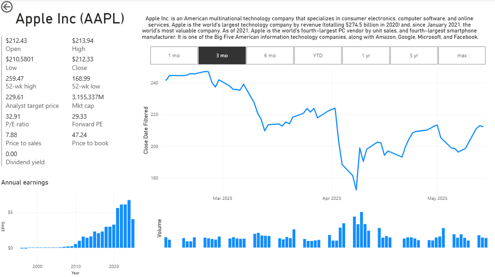

# Beverages Dashboard

---
This dashboard displays business data from the Coca-Cola company.

It can be used by the business and marketing team in Coca-Cola to plan ads campaigns and focus their operations.
The data displayed include:
- sales information by brand
- profit summary by brand
- sales by region

Limitations:
- data is limited to US sales
- only have data for 2012, could be interesting to see multi-year trends

Improvement:
- display sales information by retailer to set up future partnerships

# Data Professionals Survey Report

---

This dashboard displays data gathered from a survey of data professionals by a Youtuber. 

The data can be used by people who are thinking of working with data to get a sense of the industry.
The data displayed includes:
- count and average age of survey taker
- country of survey taker
- salary information
- favorite programming language
- degree of difficulty to break into data
- satisfaction with salary and work/life balance

Limitations:
- the data was gathered by a YouTuber, as such, it is naturally skewed towards the type of demographic that watches that type of learning content. 
- the survey allowed an "Others" response and asked for specification. All such responses were grouped in a single category.

Improvements:
- clean the "Others" response to extract valuable data.

# Stocks Dashboard

---

This last dashboard displays information about a stock, in this case Apple Inc (AAPL).

The dashboard can be used by investors to get some quick information about Apple.
The data displayed includes:
- the company name
- the stock ticker
- a description of the business
- stock price and volume information
- general info about the company, such as the market cap, P/E ratio, P/S ration, etc
- the company's earnings over the years

Limitations:
 - The price data displayed in the graph is unadjusted for stock splits and reverse splits. AlphaVantage does provide an endpoint for adjusted price data, however it requires a premium subscription.
 - The data is not up-to-date. To get the newest data the power queries will have to be run again and all the data cleaning steps will need to be repeated.

Improvements:
 - Fetch data for other big tech stocks and add a slider to the visualization so the viewer can select which stock to display.